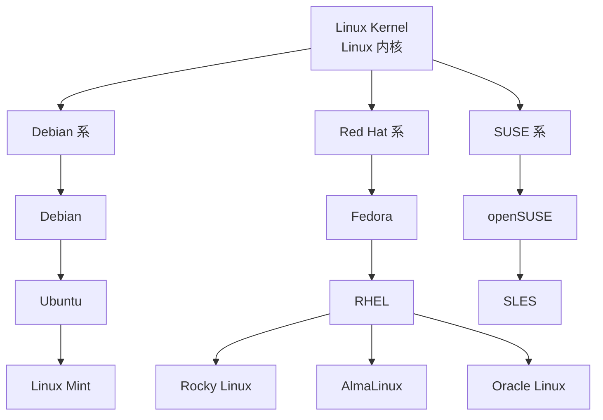

# 一、Linux 是什么

严格来说，Linux 指的是一个操作系统内核，也就是负责管理计算机硬件和系统资源的核心程序。

Linux 内核主要负责：
- 管理 CPU
- 管理内存
- 管理磁盘和文件系统
- 管理网络设备
- 管理进程
- 管理硬件驱动
- 为上层应用程序提供系统调用

不过，在日常交流中，人们说 "Linux 系统" 时，通常不是单独指 Linux 内核，而是指基于 Linux 内核构建的一整套操作系统。

例如：
- Ubuntu
- Debian
- Rocky Linux
- CentOS Stream
- openSUSE
- Arch Linux



这些都属于 Linux 发行版。

# 二、什么是 Linux 发行版

仅有 Linux 内核，还不足以让普通用户方便地使用计算机。

一个完整的 Linux 发行版通常包含：
```
Linux 内核
   +
基础命令和系统工具
   +
软件包管理
   +
系统服务管理工具
   +
默认配置
   +
发行版自己的软件仓库
```

不同发行版会在软件管理方式、默认配置、更新策略和使用场景上有所不同。

例如：

|   Linux 发行版   |          常见特点          |
| :-----------: | :--------------------: |
|    Ubuntu     |    入门资料丰富，云服务器中很常见     |
|    Debian     | 稳定，Ubuntu 基于 Debian 构建 |
|  Rocky Linux  |       常用于企业服务器环境       |
| CentOS Stream |    偏向企业 Linux 上游开发     |
|  Arch Linux   |     高度自定义，适合有经验的用户     |

# 三、Ubuntu 是什么

Ubuntu 是一个基于 Debian 构建的 Linux 发行版。

可以将两者的关系简单理解为：
```
Linux
└── Linux 发行版
    ├── Debian
    │   └── Ubuntu
    ├── Rocky Linux
    ├── CentOS Stream
    └── 其他发行版
```

因此：
- Linux 是更大的操作系统家族
- Ubuntu 是 Linux 发行版之一
- 当前服务器运行的是 Ubuntu，而不是一个名为 "Linux" 的单一完整操作系统

# 四、Ubuntu Server 24.04 LTS

当前腾讯云服务器安装的是：
```
Ubuntu Server 24.04 LTS 64-bit
```

## 1、Ubuntu Server

Server 表示这是面向服务器场景的 Ubuntu 系统。

服务器系统通常以命令行管理为主，不需要像 Windows 一样安装完整桌面环境。

服务器不安装桌面环境的常见原因包括：
- 节省内存
- 节省磁盘空间
- 减少不必要的软件
- 降低系统攻击面
- 方便远程自动化管理

## 2、24.04

Ubuntu 的版本号通常由发布年份和月份组成：
```
24.04
```

表示这一版本最初发布于：
```
2024 年 4 月
```

## 3、LTS

LTS 是：
```
Long Term Support
```

即长期支持版本。

LTS 版本通常更适合作为服务器系统，因为它更注重稳定性，并且维护周期较长

## 4、64-bit

64-bit 表示当前操作系统使用的是 64 位架构，可以正常使用较大的内存空间，也符合现代服务器的常见配置。

# 五、什么是云服务器

云服务器可以理解为云厂商通过虚拟化技术提供的一台远程计算机。

它和本地电脑一样，也具有：
- CPU
- 内存
- 磁盘
- 操作系统
- 网路接口
- IP 地址
- 用户和密码
- 运行中的进程和服务

不同之处是：

|       本地电脑        |       云服务器       |
| :---------------: | :--------------: |
|      放在自己身边       |    放在云厂商的数据中心    |
|   可以直接使用键盘和显示器    |    通常通过网络远程操作    |
| 长安装 Windows 和桌面软件 | 常安装 Linux Server |
|     关闭电脑后服务停止     |     可以长期保持运行     |
|   通常处于家庭或公司局域网    |    通常拥有公网 IP     |

当前使用的是腾讯云轻量应用服务器。

# 六、本地电脑与云服务器的关系

当前操作环境可以表示为：
```
Windows 本地电脑
     ↓
Windows Terminal 或 PowerShell
     ↓
  SSH 协议
     ↓
   互联网
     ↓
腾讯云轻量服务器防火墙
     ↓
Ubuntu 云服务器
     ↓
   Shell
     ↓
Linux 命令和程序
```

本地 Windows 电脑属于客户端，腾讯云 Ubuntu 主机属于服务器端。

平时输入命令的位置虽然显示在本地屏幕上，但登录服务器之后，命令实际上是在远程 Ubuntu 服务器上执行的。

# 七、基础术语

## 1、本地与远程

本地通常指自己正在使用的 Windows 电脑

远程通常指通过网络连接的腾讯云 Ubuntu 服务器

例如：
```
D:\Development
```

属于本地 Windows 文件系统。

而：
```
/home/ubuntu
```

属于远程 Ubuntu 文件系统。

两者不是同一个磁盘，也不是同一个操作系统。

## 2、客户端与服务器

客户端负责发起连接和请求

服务器负责接收连接并提供服务

当前场景中：
```
Windows 电脑：客户端
Ubuntu 云服务器：服务器
```

以后部署网站时：
```
浏览器：客户端
Nginx 或 Spring Boot：服务器程序
```

## 3、终端 Terminal

终端是用于输入命令、显示命令结果的交互界面

Windows 上常见的终端包括：
- Windows Terminal
- PowerShell 窗口
- CMD
- Intellij IDEA Terminal

终端本身主要负责显示和输入，并不等同于 Linux 操作系统

## 4、Shell

Shell 是负责接收、解释并执行命令的程序

常见 Shell 包括：
- Bash
- Zsh
- Fish
- Sh

Ubuntu 用户通常使用 Bash，后续可以通过命令确认当前 Shell。

终端与 Shell 的关系可以简单理解为：
```
终端：负责显示和输入
Shell：负责理解和执行命令
```

## 5、SSH

SSH 全称为 Secure Shell ，是一种安全的远程连接协议。

它可以用于：
- 远程登录 Linux 服务器
- 在服务器上执行命令
- 传输文件
- 使用 SSH 密钥进行身份认证
- 建议安全隧道

默认情况下，==SSH 服务通常使用 TCP 22 端口==

## 6、公网 IP

公网 IP 是可以通过互联网访问的 IP 地址。

腾讯云服务器拥有公网 IP ，因此本地 Windows 电脑可以通过互联网连接这台服务器。

公网 IP 类似于服务器在互联网上的地址。

公网 IP 本身不是密码，但公开后可能增加被自动扫描和尝试登录的次数。

## 7、内网 IP

内网 IP 主要用于同一云网络或局域网内部通信。

当前腾讯云控制台中可以看到 类似：
```
10.x.x.x
```

这样的地址，这通常属于内网地址。

公网 IP 和内网 IP 的用途不同：

| 地址类型  |      常见用途      |
| :---: | :------------: |
| 公网 IP |   从互联网连接服务器    |
| 内网 IP | 云服务器之间或局域网内部通信 |

## 8、root

root 是 Linux 系统中的最高权限用户。

root 可以：
- 修改系统配置
- 安装和删除软件
- 修改其他用户文件
- 启动和停止服务
- 删除系统文件

因此，直接长期使用 root 操作存在较高风险。

当前使用的默认用户是：
```
ubuntu
```

它属于普通用户，但通常拥有使用 sudo 临时执行管理员命令的权限。

## 9、sudo

sudo 用于以更高权限执行某一条命令。

例如：
```bash
sudo apt update
```

可以拆分为：
```
sudo
└── 以管理员权限执行后面的命令

apt update
└── 更新软件包索引
```

使用普通用户登录，需要管理员权限时再使用 sudo，比始终使用 root 更安全。